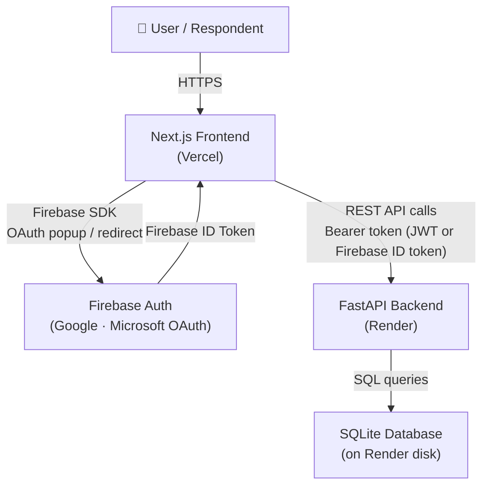

# Typeform Clone

A full-stack, production-ready Typeform clone — build beautiful one-question-at-a-time forms, collect real responses, view analytics, and export data to CSV.

[](https://typeform-clone-woad.vercel.app/)
[](https://nextjs.org/)
[](https://fastapi.tiangolo.com/)
[](https://firebase.google.com/)
[](https://www.sqlite.org/)

---

## Table of Contents

- [Live Demo](#live-demo)
- [Project Overview](#project-overview)
- [Features](#features)
- [Screenshots](#screenshots)
- [Tech Stack](#tech-stack)
- [Architecture](#architecture)
- [Project Structure](#project-structure)
- [Getting Started](#getting-started)
- [Running Locally](#running-locally)
- [API Overview](#api-overview)
- [Authentication](#authentication)
- [Database](#database)
- [Deployment](#deployment)
- [Design Decisions](#design-decisions)
- [Assumptions & Notes](#assumptions--notes)
- [Future Improvements](#future-improvements)
- [Author](#author)

---

## Live Demo

| Service | URL |
|---------|-----|
| **Frontend** | [https://typeform-clone-woad.vercel.app/](https://typeform-clone-woad.vercel.app/) |
| **Backend API** | Hosted on Render (connected automatically by the frontend) |

---

## Project Overview

This project is a full-stack clone of [Typeform](https://www.typeform.com/) — a platform for creating engaging, conversational forms. It replicates the core experience:

- **Form builders** can create and configure multi-question forms with a rich drag-and-drop-ordered editor.
- **Respondents** fill out forms one question at a time in a polished, distraction-free flow.
- **Form owners** view real-time response data, per-question analytics, and can export results to CSV.

The application uses Firebase Authentication for sign-in, a FastAPI backend for business logic and data persistence, and a Next.js frontend for the UI.

---

## Features

### Authentication
- Email/password registration and login
- Google OAuth sign-in (Firebase)
- Microsoft OAuth sign-in (Firebase)
- Popup-blocked fallback to redirect-based OAuth flow
- JWT token issued by the backend for subsequent API calls
- Authentication-protected routes (dashboard, form builder, results)
- Auto-redirect to dashboard after login/signup

### Dashboard
- View, search, and sort all your forms
- List and grid view modes
- Create new forms via modal
- Rename and delete forms
- Duplicate a form (including all questions and conditional logic)
- Each form shows response count

### Form Builder
- Create and edit forms with a three-panel layout (navigation / canvas / settings)
- Add, delete, and reorder questions via drag-and-drop
- Edit question title, description, and type inline
- Toggle required/optional per question
- Customise Thank You screen (headline + message)
- Live in-builder preview modal (full public-form simulation)
- Publish / unpublish toggle
- Auto-save on blur

### Question Types (8 supported)
| Type | Category |
|------|----------|
| Short Text | Text |
| Long Text | Text |
| Email | Contact |
| Multiple Choice | Choice |
| Dropdown | Choice |
| Yes / No | Choice |
| Number | Rating & Numbers |
| Rating (1–10) | Rating & Numbers |

### Conditional Logic / Branching
- Add if/then logic rules per question
- Supported actions: **Jump to** a specific question, **End** the form immediately, or continue to the **Next** question
- Conditions supported: answer value matching for Multiple Choice, Dropdown, Yes/No, and Rating
- Back navigation respects the actual visited history (history stack), not linear order

### Public Form Experience
- Shareable unique URL per form (`/form/[slug]`)
- One-question-at-a-time flow (Typeform-style)
- Welcome screen with estimated completion time
- Keyboard shortcuts (Enter to advance, A/B/C hotkeys for multiple choice, Ctrl+Enter for long text)
- Client-side validation before advancing
- Custom Thank You screen after submission

### Results & Analytics
- Response count metrics
- Per-question summary analytics:
  - Choice/dropdown: bar charts with percentages
  - Yes/No: distribution counts
  - Rating: average score and distribution breakdown
  - Number: min, max, average
  - Text: individual answer list
- Individual response table with detail modal
- Export all responses to **CSV** (one column per question, empty cells for branched/skipped questions)
- Import responses from a CSV file

---

## Screenshots

> Screenshots will appear here once added to the `screenshots/` folder.

| Screen | Preview |
|--------|---------|
| Landing Page | *(add `screenshots/landing-page.png`)* |
| Sign Up | *(add `screenshots/signup-page.png`)* |
| Login | *(add `screenshots/login-page.png`)* |
| Dashboard | *(add `screenshots/dashboard.png`)* |
| Form Builder | *(add `screenshots/form-builder.png`)* |
| Question Types | *(add `screenshots/question-types.png`)* |
| Form Preview | *(add `screenshots/form-preview.png`)* |
| Public Form | *(add `screenshots/public-form.png`)* |
| Results & Analytics | *(add `screenshots/form-results.png`)* |

---

## Tech Stack

### Frontend
| Technology | Version | Purpose |
|-----------|---------|---------|
| Next.js | 16.3.4 | React framework, routing, SSR |
| React | 19 | UI component library |
| TypeScript | 5 | Type safety |
| Vanilla CSS Modules | — | Component-scoped styling |
| @dnd-kit | 6/10 | Drag-and-drop question reordering |
| Firebase SDK | 12 | Google & Microsoft OAuth |
| Lucide React | 1.42 | Icons |

### Backend
| Technology | Version | Purpose |
|-----------|---------|---------|
| FastAPI | 0.141 | REST API framework |
| SQLAlchemy | 2.0 | ORM and database abstraction |
| Pydantic | 2 | Request/response validation |
| PyJWT | 2.13 | JWT token generation and verification |
| bcrypt | 5 | Password hashing |
| uvicorn | 0.52 | ASGI server |
| python-dotenv | 1.2 | Environment variable loading |

### Database
- **SQLite** — file-based relational database, persisted on the backend host

### Auth
- **Firebase Authentication** — Google and Microsoft OAuth (client-side)
- **PyJWT** — custom JWT for email/password sessions and backend API auth

### Deployment
- **Vercel** — Frontend hosting with automatic CI/CD from GitHub
- **Render** — Backend Python web service

---

## Architecture



**Authentication flow:**
1. User signs in via Firebase (Google/Microsoft) or email/password form.
2. For email/password: the backend issues a JWT. For OAuth: Firebase issues an ID token.
3. Both token types are sent as `Authorization: Bearer <token>` on every API request.
4. The backend resolves the token to a local user record (creating one on first OAuth login).

---

## Project Structure

```
typeform-clone/
├── frontend/                  # Next.js application
│   ├── src/
│   │   ├── app/               # Next.js App Router pages
│   │   │   ├── dashboard/     # Dashboard page
│   │   │   ├── forms/[id]/    # Form builder & results
│   │   │   ├── form/[slug]/   # Public form (respondent view)
│   │   │   ├── login/         # Login page
│   │   │   └── signup/        # Signup page
│   │   ├── components/
│   │   │   ├── auth/          # LoginForm, SignupForm
│   │   │   ├── builder/       # FormBuilderView, QuestionCanvas, QuestionSettings, etc.
│   │   │   ├── dashboard/     # Dashboard, FormCard, Sidebar, modals, etc.
│   │   │   ├── public/        # PublicFormRunner (one-question-at-a-time)
│   │   │   └── results/       # ResultsHeader, SummaryAnalytics, ResponsesTable, etc.
│   │   ├── context/           # AuthContext, ToastContext
│   │   ├── lib/               # api.ts (fetcher + token helpers)
│   │   └── types/             # Shared TypeScript interfaces
│   ├── .env.local.example     # Environment variable template
│   └── package.json
│
├── backend/                   # FastAPI application
│   ├── app/
│   │   ├── core/
│   │   │   ├── auth.py        # JWT auth, Firebase token decoding, get_current_user
│   │   │   └── database.py    # SQLAlchemy engine + session + migrations
│   │   ├── models/
│   │   │   ├── models.py      # SQLAlchemy ORM models
│   │   │   └── crud.py        # All database operations
│   │   ├── routers/
│   │   │   ├── auth.py        # POST /api/auth/signup, /login; GET /me
│   │   │   ├── forms.py       # Full forms CRUD, questions, responses, CSV export/import
│   │   │   ├── questions.py   # Standalone question update/delete
│   │   │   └── public.py      # GET/POST /api/public/forms/:slug (unauthenticated)
│   │   └── schemas/
│   │       └── schemas.py     # Pydantic request/response schemas
│   ├── main.py                # App entry point, CORS, router registration
│   ├── Procfile               # Render start command
│   └── requirements.txt       # Pinned Python dependencies
│
├── screenshots/               # Application screenshots
└── README.md
```

---

## Getting Started

### Prerequisites

- **Node.js** ≥ 18
- **Python** ≥ 3.10
- A **Firebase project** with Authentication enabled (Google + Microsoft providers)
- **Git**

### Clone the Repository

```bash
git clone https://github.com/Pratyushdev20/typeform-clone.git
cd typeform-clone
```

---

### Frontend Setup

```bash
cd frontend
npm install
```

Create your local environment file:

```bash
cp .env.local.example .env.local
```

Fill in `.env.local` with your values (see [Environment Variables](#environment-variables) below).

---

### Backend Setup

```bash
cd backend
python -m venv venv

# Windows
venv\Scripts\activate

# macOS / Linux
source venv/bin/activate

pip install -r requirements.txt
```

The SQLite database (`typeform.db`) is created automatically on first startup.

---

### Environment Variables

#### Frontend — `frontend/.env.local`

```env
# Backend API base URL
NEXT_PUBLIC_API_URL=http://localhost:8000/api

# Firebase Web App configuration
# Get these from Firebase Console → Project Settings → Your Apps → Web App → SDK Config
NEXT_PUBLIC_FIREBASE_API_KEY=
NEXT_PUBLIC_FIREBASE_AUTH_DOMAIN=
NEXT_PUBLIC_FIREBASE_PROJECT_ID=
NEXT_PUBLIC_FIREBASE_STORAGE_BUCKET=
NEXT_PUBLIC_FIREBASE_MESSAGING_SENDER_ID=
NEXT_PUBLIC_FIREBASE_APP_ID=
```

#### Backend — shell environment or `.env` file

```env
# Secret key for signing JWTs (use a long random string in production)
JWT_SECRET=your-secret-key-here

# Allowed CORS origins (comma-separated; must be set in production)
# Example: CORS_ORIGINS=https://your-app.vercel.app
CORS_ORIGINS=*
```

---

## Running Locally

### Start the Backend

```bash
cd backend
venv\Scripts\activate       # Windows
# or: source venv/bin/activate   # macOS/Linux

uvicorn main:app --reload --port 8000
```

API will be available at `http://localhost:8000`  
Interactive docs: `http://localhost:8000/docs`

### Start the Frontend

```bash
cd frontend
npm run dev
```

App will be available at `http://localhost:3000`

---

## API Overview

All authenticated endpoints require `Authorization: Bearer <token>` header.

### Auth

| Method | Endpoint | Auth | Description |
|--------|----------|------|-------------|
| `POST` | `/api/auth/signup` | No | Register a new user, returns JWT |
| `POST` | `/api/auth/login` | No | Login with email/password, returns JWT |
| `GET` | `/api/auth/me` | Yes | Get current user profile |

### Forms

| Method | Endpoint | Auth | Description |
|--------|----------|------|-------------|
| `GET` | `/api/forms/` | Yes | List all forms for current user |
| `POST` | `/api/forms/` | Yes | Create a new form |
| `GET` | `/api/forms/{id}` | Yes | Get a form with questions |
| `PUT` | `/api/forms/{id}` | Yes | Update form metadata |
| `DELETE` | `/api/forms/{id}` | Yes | Delete a form |
| `POST` | `/api/forms/{id}/duplicate` | Yes | Duplicate a form with questions and logic |
| `GET` | `/api/forms/{id}/responses` | Yes | Get all responses for a form |
| `GET` | `/api/forms/{id}/stats` | Yes | Get per-question analytics |
| `GET` | `/api/forms/{id}/export-csv` | Yes | Download responses as CSV |
| `POST` | `/api/forms/{id}/import-csv` | Yes | Import responses from CSV |
| `PUT` | `/api/forms/{id}/questions/reorder` | Yes | Reorder questions by ID list |

### Questions

| Method | Endpoint | Auth | Description |
|--------|----------|------|-------------|
| `POST` | `/api/forms/{id}/questions` | Yes | Add a question to a form |
| `PUT` | `/api/forms/{id}/questions/{qid}` | Yes | Update a question (title, type, options, logic) |
| `DELETE` | `/api/forms/{id}/questions/{qid}` | Yes | Delete a question |
| `PUT` | `/api/questions/{qid}` | Yes | Update a question (standalone) |
| `DELETE` | `/api/questions/{qid}` | Yes | Delete a question (standalone) |

### Public (No Auth)

| Method | Endpoint | Auth | Description |
|--------|----------|------|-------------|
| `GET` | `/api/public/forms/{slug}` | No | Get a published form by slug |
| `POST` | `/api/public/forms/{slug}/responses` | No | Submit a response |

---

## Authentication

The application uses a **three-tier authentication strategy**:

1. **Email/Password** — User registers/logs in via the backend (`/api/auth/signup` or `/api/auth/login`). The backend hashes passwords with bcrypt and returns a signed JWT valid for 7 days.

2. **Google / Microsoft OAuth (Firebase)** — Sign-in is handled client-side by the Firebase SDK. The resulting Firebase ID token is sent to the backend as a Bearer token. The backend decodes the token (extracting the email) and looks up or creates a matching local user record.

3. **Popup-blocked fallback** — If `signInWithPopup` is blocked by the browser, the app transparently falls back to `signInWithRedirect`, handling the redirect result on return.

All API requests include `Authorization: Bearer <token>` where the token is either the backend JWT or the Firebase ID token.

---

## Database

**Technology:** SQLite (via SQLAlchemy ORM)

**Schema overview:**

```
User
 └── Form (many)
      ├── Question (many, ordered by order_index)
      │    ├── QuestionOption (many, for multiple_choice / dropdown)
      │    └── LogicRule (many, for conditional branching)
      └── Response (many)
           └── Answer (many, one per answered question)
```

**Key relationships:**
- A `User` owns many `Form`s.
- Each `Form` has an ordered list of `Question`s.
- Choice questions (`multiple_choice`, `dropdown`) have `QuestionOption` records.
- Questions can have `LogicRule`s that define conditional jumps, ends, or pass-throughs based on the respondent's answer.
- A submitted `Response` contains one `Answer` per question the respondent answered (branched/skipped questions produce no answer record, appearing as empty cells in CSV export).

---

## Deployment

The frontend and backend are deployed as two independent services.

### Frontend — Vercel

- **URL:** [https://typeform-clone-woad.vercel.app/](https://typeform-clone-woad.vercel.app/)
- **Build command:** `npm run build`
- **Root directory:** `frontend/`
- Environment variables (all `NEXT_PUBLIC_*`) are configured in the Vercel project settings.

### Backend — Render

- **Start command:** `uvicorn main:app --host 0.0.0.0 --port $PORT`
- **Root directory:** `backend/`
- **Build command:** `pip install -r requirements.txt`
- Environment variables (`JWT_SECRET`, `CORS_ORIGINS`) are configured in the Render service settings.
- `CORS_ORIGINS` must be set to the exact Vercel frontend URL.

> **Note:** Render's free tier has an **ephemeral filesystem**. The SQLite database file is recreated on every restart. For demo purposes, `ensure_user_starter_forms()` auto-seeds two starter forms for every new user. For a persistent production database, upgrade to a persistent disk or migrate to PostgreSQL.

---

## Design Decisions

| Decision | Rationale |
|----------|-----------|
| **Separate frontend and backend** | Clean separation of concerns; enables independent deployment and scaling |
| **SQLite for the database** | Zero-config, file-based, appropriate for a demo/assignment; SQLAlchemy makes migration to PostgreSQL trivial |
| **Firebase for OAuth** | Avoids implementing OAuth provider integrations from scratch; handles token refresh, session management, and provider-specific quirks |
| **JWT for email/password sessions** | Stateless authentication; tokens carry user identity without server-side session storage |
| **History stack for branching navigation** | Back navigation in a branched form must return to the actual previously-seen question, not the linearly-previous one. A stack precisely tracks the visit order |
| **CORS via environment variable** | `allow_origins=["*"]` + `allow_credentials=True` is rejected by browsers. Using an env var allows the same code to work in dev (wildcard) and production (exact origin) |
| **Pinned dependency versions** | Reproducible builds on Render; prevents surprise breakage from upstream updates |

---

## Assumptions & Notes

- **SQLite persistence:** Data is lost on Render free-tier restarts. The auto-seeding of starter forms mitigates this for demos.
- **Firebase token verification:** Firebase ID tokens are decoded without server-side signature verification (the Firebase Admin SDK is not used). The client-side Firebase SDK is responsible for token integrity.
- **Single-user workspace:** Each user has their own isolated set of forms. There is no team/collaboration feature.
- **CSV export column order:** Columns follow the question `order_index`. Branched/skipped questions produce empty cells — the CSV always has one column per question for consistency.

---

## Future Improvements

The following are potential enhancements not currently implemented:

- **PostgreSQL** migration for persistent, production-grade data storage
- **File upload** question type
- **Date/time picker** question type
- **Multi-language / i18n** support
- **Custom form themes** and branding per form
- **Email notifications** on new response submission
- **Collaboration** — shared workspaces and multi-user form editing
- **Webhook integrations** (Zapier, Slack, etc.)
- **Enhanced analytics** — completion rate funnel, drop-off analysis, time-per-question
- **Firebase Admin SDK** integration for cryptographic JWT verification on the backend

---

## Author

**Pratyushdev20**  
GitHub: [https://github.com/Pratyushdev20](https://github.com/Pratyushdev20)

---

*Built as a full-stack engineering project demonstrating React/Next.js, FastAPI, Firebase Authentication, conditional form logic, REST API design, and cloud deployment.*